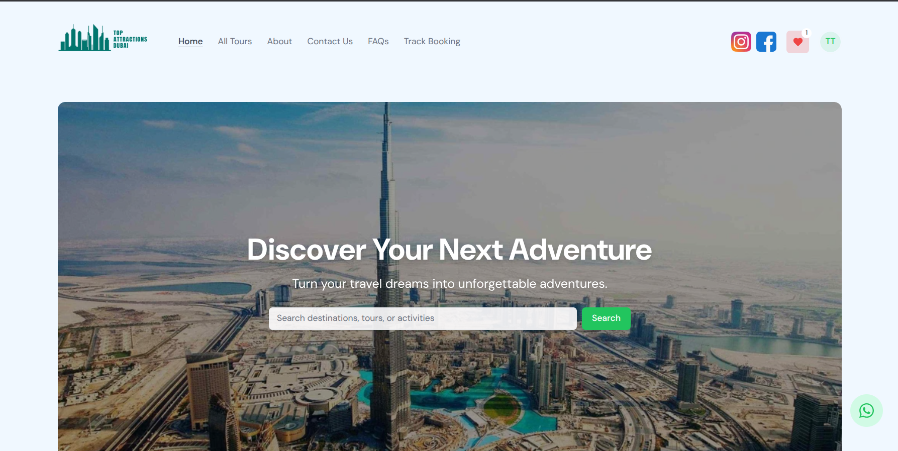

# WanderNest - Tour Tickets Booking App

<p align="center">
  <!-- Logo (small) -->
  

  <!-- Big hero screenshot / demo image -->
  <p align="center">
    
  </p>
</p>

> Web + Admin panel for a tour agency — monorepo with `admin`, `front-panel` apps and `shared` directory.

**Live demo:** rr-tours-front.onrender.com

---

## Table of contents

- [About](#about)  
- [Features](#features)  
- [Tech stack](#tech-stack)  
- [Repository layout](#repository-layout)  
- [Database / schema (Supabase / Postgres)](#database--schema-supabase--postgres)  
- [Environment variables](#environment-variables)  
- [Local development](#local-development)  
- [Build & production](#build--production)  
- [Deploying — Render](#deploying---render)  
- [Deploying — Vercel](#deploying---vercel)  
- [Adding logo / hero images to README](#adding-logo--hero-images-to-readme)  
- [Contact](#contact)

---

## About

This application is a two-panel (customer-facing front-panel and admin panel) tour agency project implemented as a single monorepo. The codebase uses React Router v7 Framework and Supabase for auth, db and storage. To boost the application performance `redis` is also used for caching through `redis-cloud`. This repo is structured as a workspace monorepo.

---

## Features

### <u>Front Panel</u>
- Browse, search, filter and sort tours
- Browse different collections/bundles (that group some tours)
- See city pages and relevant tours
- Discover detailed product pages while details include
    - Name
    - Overview
    - Cover Image + Secondary Images
    - Multiple Tour Options/Packages
    - Tour Highlights & instructions
    - Embedded Google Iframe tag showing tour/attraction location
    - Related Tags
    - Customer Reviews
    - Related Tours with respect to tour city & tour category 
- Structured Data & Meta Details for SEO 
- Add/Remove Tour from Favourites
- Select the available date and timeslot and book a tour
- Pay securely through stripe
- Track booking on rr-tours-front.onrender.com/track-booking page
- Login to your account through <b>Google</b> or <b>Email/Password</b> method
- See booking history in your account section
- Add reviews on your confirmed tour against your booking
- Get email instantly on your booking confirmation
- About Us Page
- Contact Us Page + Email Contact Form using <b>Resend</b>
- FAQs Page

### <u>Admin Panel</u>
- Add/Update/Filter Tours
- Add/Update/Delete Categories, Cities, Collections
- Add/Update/Delete Bookings
- Confirm Booking & Send confirmation emails with tickets
- Overlook through a dashboard

---

## Tech stack

- Main: React 19, React Router v7 Framework Mode
- Database / Auth / Storage: Supabase (migrations folder present). 
- Data Caching: Redis Cloud.
- Styling & UI: Shadcn-ui & Tailwind (and Lucide icons used across apps).
- Emails: Resend
- Prettier for consistent formatting
---

## Repository layout
```
(root)
├─ admin/ #Admin app (react-router-framework)
├─ front-panel/ # Public front-end (react-router-framework)
├─ shared/ # Shared functionality (e.g. Supabase functions)
├─ supabase/ # Migrations / config for DB
├─ .env.sample
├─ .tsconfig.base.json
├─ package.json # npm workspaces + scripts
```
Root `package.json` uses npm workspaces and defines convenience scripts: `dev:admin`, `dev:front`, `dev` (both), and build scripts for each workspace. Use these for local development. 

## Environment variables
```dotenv
VITE_ENV=<production or development>
NODE_ENV=<production or development>
VITE_PROJECT_ID=<ADD_YOUR_PROJECT_ID>
VITE_SUPABASE_URL=<ADD_YOUR_SUPABASE_URL>
SUPABASE_SERVICE_ROLE_KEY=<ADD_YOUR_SUPABASE_SERVICE_ROLE_KEY>
VITE_SUPABASE_ANON_KEY=<ADD_YOUR_SUPABASE_ANON_KEY>

VITE_RECAPTCHA_SITE_KEY=<RECAPTCHA_SITE_KEY>
RECAPTCHA_SECRET_KEY=<RECAPTCHA_SECRET_KEY>

VITE_MAIN_APP_URL=<https://www.xyz.com OR http://localhost:PORT>

RESEND_API_KEY=<ADD_RESEND_API_KEY>

VITE_STRIPE_PUBLISHABLE_KEY=<ADD_KEY>
STRIPE_SECRET_KEY=<ADD_KEY>

REDIS_URL=redis://<USERNAME>:<PASSWORD>@<REDIS_DB_LINK>
```
<i>You can also see sample env file from the root .env.sample</i>

## Local development

**Prereqs:** Node 22+, npm.

**Clone and install:**

```bash
git clone https://github.com/talha5978/rr-tours-app.git
cd rr-tours-app
npm install
```

**Run both apps for development:**
```bash
npm run dev
```

**Or run a single app:**
```bash
npm run dev:admin   # run only admin
npm run dev:front   # run only front-panel
```
**Notes:**
Admin and front-panel use react-router dev for local development (scripts are defined in each workspace package.json).

## Build & Deployment
Build everything from repo root using npm:

```bash
npm run build:shared
npm run build:admin
npm run build:front
# or
npm run build:all
```

Or use docker <b>(RUN FROM REPO ROOT)</b>
```bash
export $(cat .env | xargs)

docker build -f front-panel/Dockerfile \
    $(for var in $(cat .env | cut -d= -f1); do echo "--build-arg $var=${!var}"; done) \
    -t rr-tours-app .

docker run --env-file .env -p 3000:3000 front-panel
```

## Deploying on Render

The simplest and most reliable way to host both apps in a monorepo is to create **two separate Render services** — one for each app.

### Service 1 — front-panel

- **Name:** `front-panel` (or similar)
- **Environment:** Docker
- **Dockerfile Path:** front-panel/Dockerfile
- **Environment Variables:** Add these from `.env`
- **Secret Variable File:** Add `.env` file and its content

### Service 2 — admin-panel

- **Name:** `admin-panel` (or similar)
- **Environment:** Docker
- **Dockerfile Path:** admin-panel/Dockerfile
- **Environment Variables:** Add these from `.env`
- **Secret Variable File:** Add `.env` file and its content

### Important Render Notes

- **Two services is strongly recommended** for monorepos  
    (One service per app → each points to its own subdirectory)

- **Security rule**  
  Environment variables that are not prefixed by VITE_ must **never** be sent to the browser.

## Deploying on Vercel

Vercel handles monorepos and React Router well, but the cleanest split is usually:

### Recommended: front-panel → Vercel   +   admin → Render

#### front-panel on Vercel

1. New Vercel project → Import repo
2. **Root Directory:** `/front-panel`
3. **Build Command** (optional — Vercel often auto-detects):
   ```bash
   npm run build -w front-panel
   ```
4. **Output Directory:** usually auto-detected (`./front-panel/build`)
5. **Environment Variables** (in Vercel dashboard):
   - `VITE_SUPABASE_URL`
   - `VITE_SUPABASE_ANON_KEY`
   - all other variables

#### admin → keep on Render

Use the Render setup shown above — this keeps your service role key 100% server-side.

### Alternative: Both on Vercel

- **Two separate projects** (easiest):
    - Project 1 → Root: `/front-panel`
    - Project 2 → Root: `/admin`

- **Single project + rewrites** → requires `vercel.json` configuration

<u><i>Developed by Talha — open an issue or contact at muhammadtalha13457@gmail.com.<i><u>